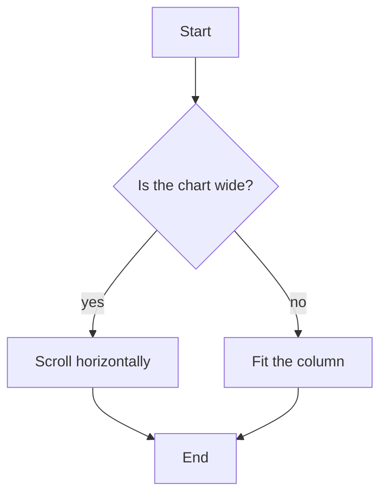

+++
title = "DyCo Skills in One Line"
date = 2026-09-10T12:00:00+09:00
type = "note"
tags = ["DyCo Skills", "Learning with Agentic AI"]
+++
DyCo Skills in one line: humans choose and oversee, agents draft and scale, the workflow is dynamic.

