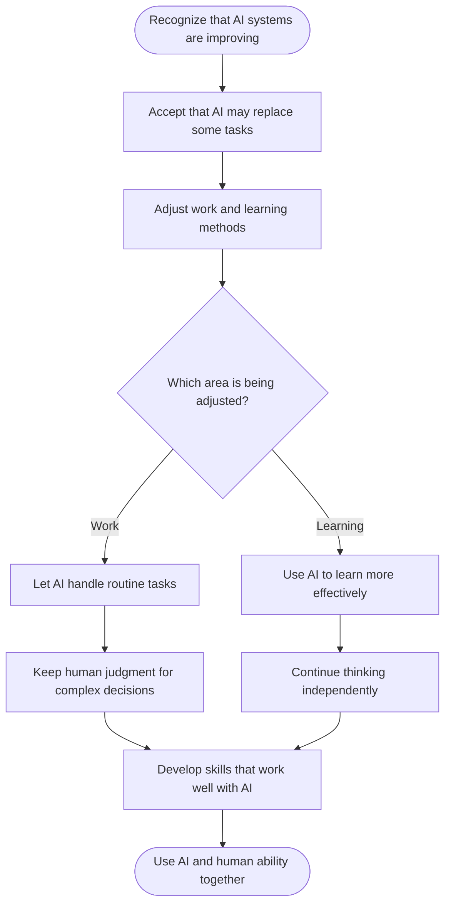

+++
title = "Coping with the Rise of Agentic AI"
date = 2026-09-27T10:09:37+09:00
tags = ["Evolving with AI", "Agentic AI", "Human Skills"]
author = "zhumengyao"
institute = "DyCoAI.com"
showTitle = true
description = "Agentic AI will inevitably change the way we work and learn, including replacing some tasks that humans currently perform. Rather than resisting this change, coping with AI means accepting its growing capabilities, adapting to its use, and developing the skills needed to work alongside it while maintaining human judgment and responsibility."
+++

How much should we expect to remain unchanged in our work and learning as agentic AI develops? I think agentic AI is something we cannot simply avoid; we will have to accept it and learn how to cope with it. Its capabilities are not fixed, but continuously accumulated and improved over time. For people who are not directly involved in AI development, it is difficult to predict what these systems will be able to do in the near future. This makes the idea that “AI should never replace us” difficult to maintain as a general principle. In some areas, AI may already be able to perform tasks with higher efficiency, greater consistency, and lower cost than humans. Accepting this does not necessarily mean giving up human value. Rather, it means recognizing a technological change that people have faced in different forms throughout history.

From my perspective, coping with agentic AI therefore means adjusting the way I think about work and learning. Instead of focusing only on protecting tasks from being replaced, I think it is more useful to understand which abilities AI can perform better and which abilities still require human judgment, experience, and responsibility. In work, this may mean allowing AI to take over routine or highly structured tasks while developing skills that complement its capabilities. In learning, it means using AI to improve understanding and efficiency without depending on it so much that independent thinking becomes weaker. I do not think the goal should be to compete with AI in every area. It is more practical to accept that some forms of human work will be replaced, learn how to work alongside increasingly capable systems, and continue developing the abilities that allow us to make meaningful use of them.

