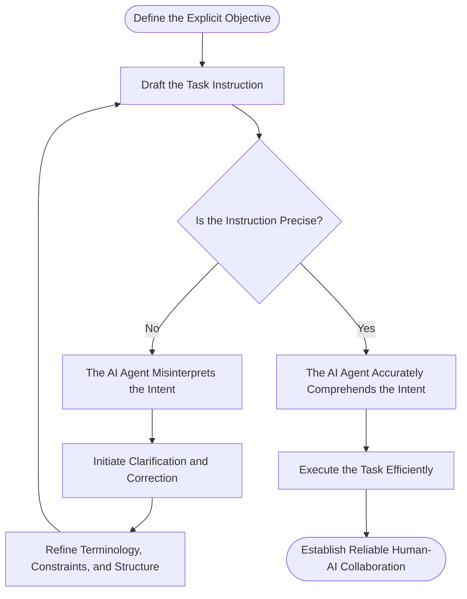
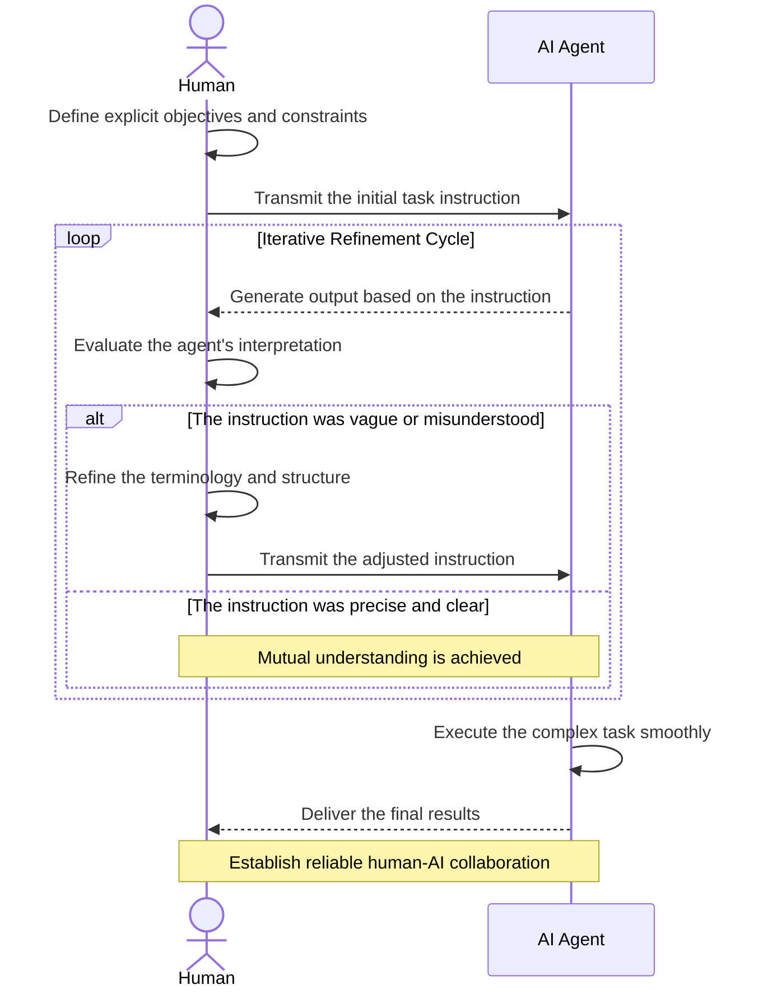

+++
title = "Task Instruction Precision Engineering: Communicating Effectively with AI Agents"
date = 2026-09-27T10:49:37+09:00
tags = ["Evolving with AI", "Agentic AI", "Human Skills"]
author = "zhumengyao"
institute = "DyCoAI.com"
showTitle = true
description = "Precise instructions can make human–AI collaboration more efficient and reliable by reducing misunderstandings, clarification, and unnecessary iteration. “Task Instruction Precision Engineering” describes the iterative effort to construct instructions that help AI agents understand and perform complex tasks more effectively."
+++

When I work with an AI agent on a complex task, I find that the precision of my instructions can have a significant effect on how smoothly the work proceeds. A vague instruction may lead to results that require several rounds of clarification, correction, and confirmation. A more precise instruction can give the agent a clearer understanding of what I expect from the beginning, which can save time for both the human and the AI. This makes me think that the interaction between a human and an AI agent deserves as much attention as the capabilities of the agent itself. Even a highly capable agent still needs to understand what the human intends to accomplish.

This is where I would like to introduce the idea of **Task Instruction Precision Engineering**. I use this term to describe the deliberate effort to construct task instructions with accurate terminology, topic-relevant expressions, clear relationships, appropriate constraints, and explicit objectives. The purpose is to make communication with an AI agent more precise and reduce unnecessary clarification during the task. I see this as an iterative process because the quality of an instruction can become clearer through the agent's responses. When the output shows that an instruction has been misunderstood or interpreted differently from what I intended, I can adjust the wording and structure and try again. Over time, this process can help establish a more efficient way of communicating with the agent.

Human communication provides a useful reference here. When people work together, proficiency and reliability often depend on how clearly they understand each other's intentions. The same principle becomes relevant when a human works with an AI agent. Precise instructions can function as a practical communication tool that helps both sides spend less time clarifying what was intended and more time performing the actual task. As AI agents become capable of handling longer and more complicated tasks, I think this aspect of human-AI interaction will become increasingly important.

Perhaps the term **Task Instruction Precision Engineering** has already been used somewhere by someone else. Even if that is the case, I still find the idea valuable, and I would be happy to see the concept developed further. If the term is new, discovering that would be exciting as well. For me, the most important point is the idea itself: as humans begin to work with AI agents more closely, precise communication will become an increasingly important part of making that cooperation efficient and reliable. Whoever first proposed such an idea would certainly have introduced a useful way of thinking about human-AI collaboration.

