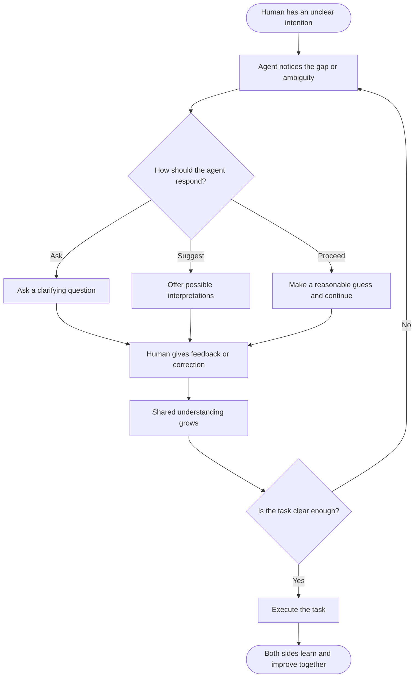

+++
title = "When AI Understands What We Cannot Fully Express"
date = 2026-09-27T11:09:42+09:00
tags = ["Evolving with AI", "Agentic AI", "Human Skills"]
author = "zhumengyao"
institute = "DyCoAI.com"
showTitle = true
description = "I see proactive collaboration as one of the most valuable possibilities of agentic AI. When humans cannot fully explain what they need, an agent could recognize implicit cues, clarify unclear intentions, and help turn incomplete ideas into concrete tasks. This would make human-AI interaction more efficient by allowing both sides to gradually develop a shared understanding rather than requiring perfect instructions from the beginning."
+++

When I instruct an agent to perform different tasks, I often expect it to understand more than what I explicitly write in the instructions. In many situations, I know what I want to achieve, but I do not know how to describe the problem completely, especially when I am dealing with a topic that is unfamiliar to me. This makes proactive collaboration one of the most interesting possibilities I see in agentic AI. If an agent can recognize the meaning behind incomplete instructions, identify important implicit cues, and help me turn an unclear intention into a more concrete task, the interaction could become much more efficient. The agent would contribute not only by executing what I have already formulated, but also by helping me formulate what I have not yet been able to express clearly.

This capability could be particularly valuable when I encounter a problem for which I lack the necessary knowledge or vocabulary. I may recognize that something is wrong, have a general idea of what I want, or sense that there is a better way to approach a task, while still being unable to explain the issue precisely. In such situations, I would expect an agent to notice the uncertainty or ambiguity in my instructions and respond appropriately. It could ask a useful question, suggest possible interpretations, identify information that is missing, or translate my rough intention into a more precise task. This kind of interaction would allow the agent and the human to gradually build a shared understanding instead of requiring the human to formulate everything correctly at the beginning.

For this kind of collaboration to work, I think an agent needs to adapt to the way a human communicates and works. Human communication often contains hesitation, incomplete explanations, changes in priority, and assumptions that are left unstated. An effective agent should be able to recognize these signals and adjust its behavior accordingly. Sometimes it may need to ask for clarification; at other times, it may be more useful to make a reasonable interpretation and continue the task. The appropriate level of autonomy may also change during the process, depending on the human's feedback and the importance of the decision.

This gives me a different way to think about coping with agentic AI. I do not expect the agent to become an independent actor that simply takes over a task. I would rather see it as a system that can adapt to human cognitive and operational rhythms while helping humans clarify what they actually need. The most useful interaction may therefore occur when both sides gradually improve their understanding during the task. If agentic AI can develop this kind of proactive collaboration, it could help address problems that are difficult for humans precisely because we do not yet know how to formulate them.

