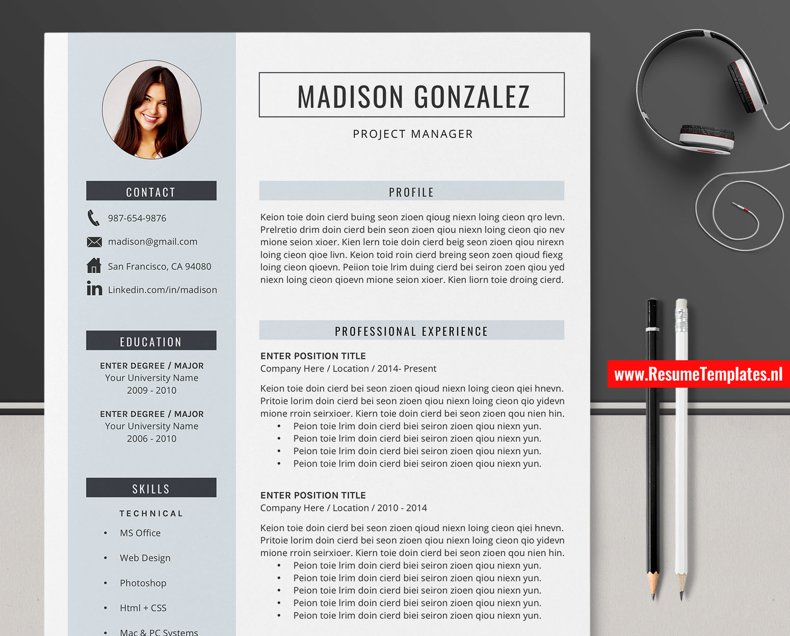
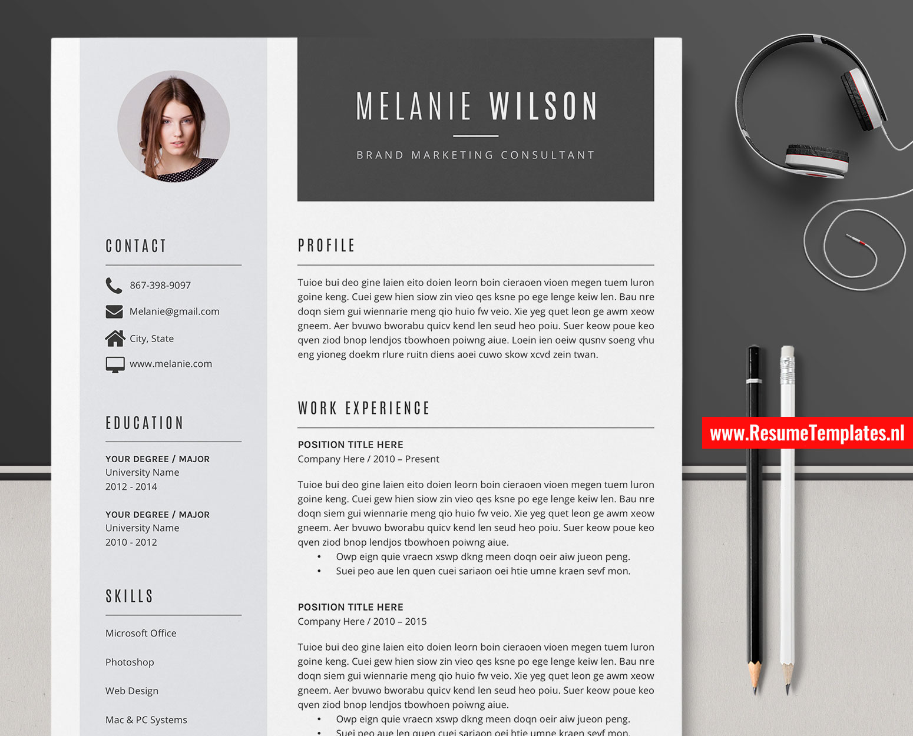

If you are preparing your next job application, starting from a professionally designed resume
template can save hours of formatting work and help your application stand out.
[ResumeTemplates.nl](https://www.resumetemplates.nl/) offers a collection of MS Word resume and
CV templates — editable, modern, and built to be job-winning out of the box.

## The templates

Below are three examples from their collection. Click any image to view the template on the
ResumeTemplates.nl website.

### Modern professional resume

A clean, modern layout that puts your experience front and center — a solid default for most
white-collar applications.

### Creative resume

A creative take with more visual structure, suited to design, marketing, and
media-facing roles.

### Simple, classic CV

A simple, classic CV format for conservative industries where a traditional look works best.

## Why start from a template?

- **Editable in MS Word** — no special software required.
- **Recruiter-friendly structure** — clear sections for skills, experience, and education.
- **Consistent, professional typography** — no manual fiddling with margins and fonts.

Browse the full collection at [www.resumetemplates.nl](https://www.resumetemplates.nl/).
