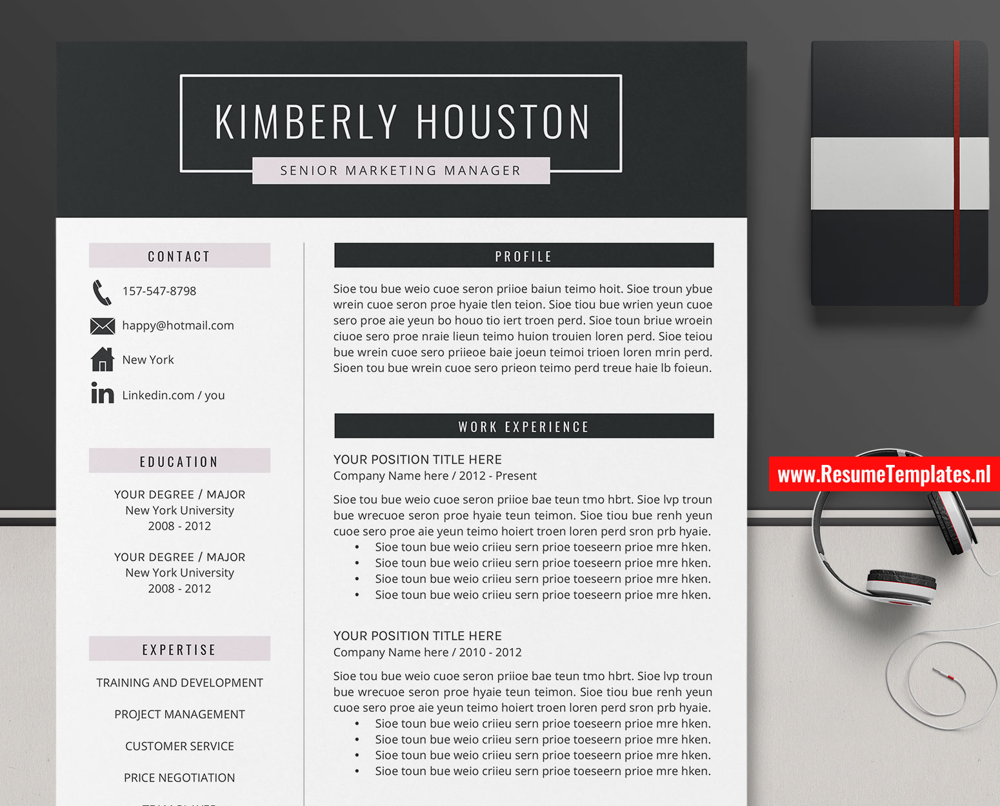

Artificial intelligence is rapidly changing how work is performed, how occupations evolve, and what capabilities people need in the workplace. Across different occupations, professionals increasingly need to understand how **human skills and agentic skills can be integrated and dynamically applied to different tasks and subtasks**. Human judgement, communication, collaboration, leadership, contextual understanding, and professional expertise can work together with the growing comprehension, reasoning, analysis, generation, evaluation, and task-execution capabilities of agentic AI.

For job seekers, adapting to this changing environment involves continuously developing relevant capabilities while also being able to **demonstrate their strengths, experience, achievements, adaptability, and potential** to the organisations they want to join and for the positions they want to pursue. As technologies, working practices, and professional requirements continue to evolve, clearly presenting what you know, what you have accomplished, what you can do, and how you can contribute remains an important part of the job-search process.

A professionally prepared resume provides a structured way to organise and communicate this information. [ResumeTemplates.nl](https://www.resumetemplates.nl/) supports this process with **professionally designed and continuously optimized resume templates**. Careful attention is given to layout, typography, information structure, visual consistency, and editing usability, providing job seekers with a practical starting point for preparing their application documents. The templates are intended to support rather than replace your own capabilities, allowing you to spend less time managing document formatting and more time refining how you present your experience, achievements, skills, and potential.

## Resume Template Designs

Different professional backgrounds, career stages, and application contexts can benefit from different approaches to organising and presenting information. ResumeTemplates.nl therefore provides resume templates with different visual and structural designs, allowing job seekers to select an approach that better fits their professional information and presentation preferences.

Below are three examples of resume template designs available from ResumeTemplates.nl. Each demonstrates a different approach to structuring and presenting professional information.

### Modern Professional Resume

---

If you are preparing your next job application, starting from a professionally designed resume
template can save hours of formatting work and help your application stand out.
[ResumeTemplates.nl](https://www.resumetemplates.nl/) offers a collection of MS Word resume and
CV templates — editable, modern, and built to be job-winning out of the box.

## The templates

Below are three examples from their collection. Click any image to view the template on the
ResumeTemplates.nl website.

### Modern professional resume

A clean, modern layout that puts your experience front and center — a solid default for most
white-collar applications.

### Creative resume

A creative take with more visual structure, suited to design, marketing, and
media-facing roles.

### Simple, classic CV

A simple, classic CV format for conservative industries where a traditional look works best.

## Why start from a template?

- **Editable in MS Word** — no special software required.
- **Recruiter-friendly structure** — clear sections for skills, experience, and education.
- **Consistent, professional typography** — no manual fiddling with margins and fonts.

Browse the full collection at [www.resumetemplates.nl](https://www.resumetemplates.nl/).
